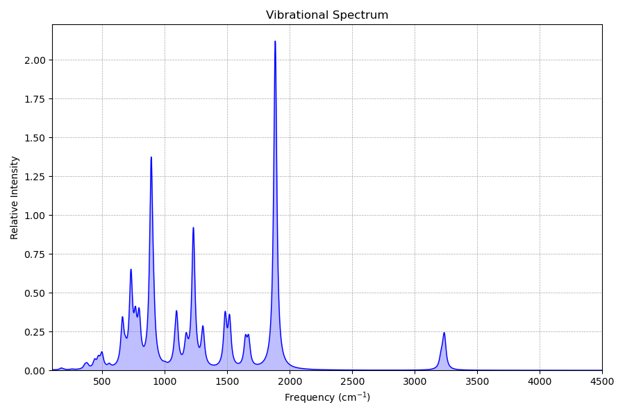

## IRtools - IR spectra generation via the double harmonic approximation

This repository contains tools to generate IR spectra from the double harmonic approximation.


### Building the program
To build the `irtools` binary with CMake use the following chain of commands (in this example with `gfortran/gcc` compilers):
```bash
FC=gfortran CC=gcc cmake -B _build
```
and then followed by
```bash
make -C _build
```

### Running the program

See the [`example/`](example/) subdirectory for an use-case example.
The directory contrains the following required files:
- [`struc.xyz`](example/struc.xyz), the input geometry at which dipole derivatives and the Hessian were calculated
- [`dipgrad`](example/dipgrad), a plain-text file with the 6N<sub>at</sub> entries that are the Cartesian dipole derivatives in atomic units
- [`numhess`](example/numhess), the seminumerical Hessian (non-massweighted, in Hartree and Bohr) here in the Turbomole output format. A plain-text format with 3N<sub>at</sub> lines á 3N<sub>at</sub> entries is also valid input.

Additionally the [`vibspectrum.ref`](example/vibspectrum.ref) file provides a higher-level reference spectrum.

With the compiled program run

```bash
irtools struc.xyz -dip dipgrad -hess numhess -s 0.9606 
```

which should produce the following output:

```
 irtools v0.1 Wed, 15 May 14:43:21, 05/15/2024
 commit (5896188) compiled by 'philipp@xps15'
 
 This program is distributed in the hope that it will be useful,
 but WITHOUT ANY WARRANTY; without even the implied warranty of
 MERCHANTABILITY or FITNESS FOR A PARTICULAR PURPOSE.
 
 **************************************************************
 PLEASE MAKE SURE HESSIAN AND DIPOLE FILES ARE IN ATOMIC UNITS!
 **************************************************************
 
 --------------------------------------------------
 Input structure : struc.xyz
 Input Hessian   : numhess
 Input dμ/dR     : dipgrad
 Scaling factor  :   0.96060
 Output file     : vibspectrum
 --------------------------------------------------
 Allocated data:
   nat 14
   at(14)
   xyz(3,14)
   hess(42,42)
   dipd(3,42)
 --------------------------------------------------
 ZPVE / Eh        :        0.088380841694293
 thermodynamics @  298.15K :
 H_vib / kcal/mol :        3.731781748516586
 S_vib / cal/molK :       22.992769821068045
 --------------------------------------------------
 vibspectrum written.
```

The program uses the read-in unmodified Hessian and structure to first calculate the mass-weighted one and project out translation and rotation of the molecule.
By diagonalization of the mass-weighted Hessian, vibrational frequencies and the corresponding normal modes are determined. 
Finally, the Cartesian dipole derivatives are projected along the modes to determine IR intensities according to the doubly-harmonic approximation.


The produced `vibspectrum` file can be processed further by the command

```bash
irtools vibspectrum --plot
```
which applies Lorentzian line shape functions to each frequency/intensity pair and writes a plain-text file `spectrum.txt` that can be plotted with gnuplot or the included [irplot.py](plot/irplot.py) matplotlib script:



